# Database ERD — Rivers State Climate & Disaster Management Platform

Entity-relationship diagram for the PostgreSQL/PostGIS schema. Rendered natively by GitHub/GitLab from the `mermaid` block below.

This README is written for someone opening a database diagram for the first time — no prior database experience assumed.

## How to Read This Diagram

An ERD (Entity Relationship Diagram) is just a map of the tables in the database and the lines that connect them. Each box is a table (a spreadsheet, basically — rows and columns). Each line between two boxes says "rows in this table can be linked to rows in that table." The rest of this section explains exactly what the letters and symbols on those lines and columns mean.

### The letters next to a column name

| Symbol | Name | Plain-English meaning |
|---|---|---|
| `PK` | Primary Key | This column is the row's unique ID — like a national ID number. No two rows in the table can ever share one, and every table has exactly one. |
| `FK` | Foreign Key | This column stores the ID of a row in *another* table. It's the actual "pointer" that draws the connecting line on the diagram — if `DISASTER_EVENTS` has `admin_unit_id FK`, that means every disaster event row is stamped with which admin unit (LGA/ward) it happened in. |
| `UK` | Unique Key | Like a PK in that no two rows can share the value — but it's not the row's official ID. `USERS.firebase_uid UK` means two different platform accounts can never share the same Firebase login, even though `user_id` (the `PK`) is still the ID everything else points to. |

### The symbols on the connecting lines

Every line has a little mark at *each* end, and you read the mark closest to a box as describing that box's side of the relationship. There are only two ideas combined:

| Mark | Meaning |
|---|---|
| `\|\|` | **exactly one** — required, and never more than one |
| `o{` | **zero or many** — optional, could be none, could be a lot |

So take this line from the diagram:

```
COUNTRIES ||--o{ ADMIN_UNITS : has
```

Read it in two halves, one for each end:

- The `\|\|` sits next to `COUNTRIES`, so it describes **how many `ADMIN_UNITS` rows can point back to one `COUNTRIES` row** — the answer here is irrelevant to that end; instead flip it: the `\|\|` actually tells you that *each* `ADMIN_UNITS` row belongs to **exactly one** country. An admin unit (an LGA, say) can't belong to two countries, and it can't belong to none.
- The `o{` sits next to `ADMIN_UNITS`, so it tells you **how many `ADMIN_UNITS` rows one `COUNTRIES` row can have**: **zero or many**. Nigeria can have many admin units; a brand-new country row with no admin units loaded yet is also fine.

In plain English, the whole line says: *"Every admin unit belongs to exactly one country. A country can have zero, one, or many admin units."* Every other line in the diagram reads the same way — find the mark next to each box, and it tells you the rule for that box's side.

### The words in `{ }` under a table name

These are the table's columns — its "spreadsheet headers." Before each column name is its data type:

- `uuid` — a long, randomly generated ID (safer than counting 1, 2, 3 when data from many sources gets merged together, since two different sources can never accidentally generate the same one).
- `text` — ordinary words or short phrases.
- `geometry` — a shape on a map (a point, a line, or an area) that PostGIS can use to answer questions like "what's inside this boundary?" or "how far apart are these?"
- `smallint` / `int` / `numeric` — whole numbers, whole numbers, and numbers with decimals, respectively.
- `date` — a calendar date.

A short phrase in quotes after a column (like `"nullable, self-referencing"`) is just a plain-English note about that column — not part of the database itself.

## Entity Relationship Diagram

```mermaid
erDiagram
    COUNTRIES ||--o{ ADMIN_UNITS : has
    ADMIN_UNITS ||--o{ ADMIN_UNITS : "has sub-unit"
    ADMIN_UNITS ||--o{ SETTLEMENT_POINTS : has
    ADMIN_UNITS ||--o{ SETTLEMENT_EXTENTS : has
    ADMIN_UNITS ||--o{ BUILDINGS : contains
    ADMIN_UNITS ||--o{ INFRASTRUCTURE : contains
    ADMIN_UNITS ||--o{ DISASTER_EVENTS : "occurred in"
    ADMIN_UNITS ||--o{ RAINFALL_OBSERVATIONS : "measured for"
    ADMIN_UNITS ||--o{ POPULATION_ESTIMATES : "estimated for"
    ADMIN_UNITS ||--o{ USERS : "scopes access for"
    COUNTRIES ||--o{ ROADS : has
    COUNTRIES ||--o{ WATERWAYS : has
    COUNTRIES ||--o{ FLOOD_SUSCEPTIBILITY_ZONES : has
    DISASTER_TYPES ||--o{ DISASTER_EVENTS : classifies
    DISASTER_TYPES ||--o{ DISASTER_TYPES : "has subtype"
    ROLES ||--o{ USERS : "assigned to"

    COUNTRIES {
        text country_code PK "ISO 3166-1 alpha-3, e.g. NGA"
        text country_name
        geometry geom "MultiPolygon, SRID 4326, nullable until pulled"
        uuid source_id FK
    }
    ADMIN_UNITS {
        uuid admin_unit_id PK
        text country_code FK
        uuid parent_id FK "nullable, self-referencing"
        smallint level "1=state/region, 2=LGA-equivalent, 3=ward-equivalent"
        text level_name "country's own term: State / LGA / Ward for Nigeria"
        text unit_name
        text unit_code "source pcode, e.g. OCHA ADM2_PCODE — not globally unique alone"
        geometry geom "Polygon or MultiPolygon, SRID 4326"
        uuid source_id FK
    }
    SETTLEMENT_POINTS {
        uuid settlement_id PK
        uuid admin_unit_id FK
        text source_settlement_code "e.g. GRID3 set_id"
        text settlement_name
        geometry geom "Point, SRID 4326"
        uuid source_id FK
    }
    SETTLEMENT_EXTENTS {
        uuid settlement_id PK "same id as SETTLEMENT_POINTS"
        uuid admin_unit_id FK
        geometry geom "Polygon, SRID 4326"
        uuid source_id FK
    }
    ROADS {
        uuid road_id PK
        text country_code FK
        text name
        text road_class
        geometry geom "LineString, SRID 4326"
        uuid source_id FK
    }
    WATERWAYS {
        uuid waterway_id PK
        text country_code FK
        text name
        text waterway_type "river / creek"
        geometry geom "LineString or Polygon, SRID 4326"
        uuid source_id FK
    }
    BUILDINGS {
        uuid building_id PK
        uuid admin_unit_id FK
        text country_code FK
        geometry geom "Polygon, SRID 4326"
        uuid source_id FK
    }
    INFRASTRUCTURE {
        uuid infrastructure_id PK
        uuid admin_unit_id FK
        text country_code FK
        text name
        text facility_type "hospital / school / market / government"
        geometry geom "Point, SRID 4326"
        uuid source_id FK
    }
    DISASTER_TYPES {
        smallint disaster_type_id PK
        smallint parent_type_id FK "nullable, self-referencing"
        text type_name
    }
    DISASTER_EVENTS {
        uuid event_id PK
        smallint disaster_type_id FK
        uuid admin_unit_id FK
        text country_code FK
        date event_date
        text community
        text severity
        int affected_population
        int fatalities
        numeric economic_damage
        geometry geom "Point, SRID 4326, nullable"
        text data_type "OBSERVED/DERIVED/MODELLED/ESTIMATED/SYNTHETIC, mandatory"
        text confidence_level
        uuid source_id FK
    }
    FLOOD_SUSCEPTIBILITY_ZONES {
        uuid zone_id PK
        text country_code FK
        text risk_level
        geometry geom "Polygon, SRID 4326"
        text data_type "DERIVED"
        text methodology
        uuid source_id FK
    }
    RAINFALL_OBSERVATIONS {
        uuid rainfall_id PK
        uuid admin_unit_id FK
        text country_code FK
        text year_month "YYYY-MM"
        numeric mean_rainfall_mm "nullable for an incomplete current month"
        text data_type "OBSERVED"
        uuid source_id FK
    }
    POPULATION_ESTIMATES {
        uuid population_id PK
        uuid admin_unit_id FK
        text country_code FK
        smallint year
        numeric total_population
        text data_type "MODELLED"
        text method
        uuid source_id FK
    }
    DATA_SOURCES {
        uuid source_id PK
        text provider
        text dataset_name
        text url
        text license
        text coverage_scope "e.g. Nigeria - Rivers State, Nigeria - National, Global"
        date last_updated
        text reliability "HIGH/MEDIUM/LOW/UNKNOWN"
    }
    ROLES {
        smallint role_id PK
        text role_name
        text description
    }
    USERS {
        uuid user_id PK
        text firebase_uid UK "unique, NOT NULL — Firebase Authentication's identity for this user; no password is ever stored here"
        smallint role_id FK
        uuid scope_admin_unit_id FK "nullable — null means unrestricted access"
        text name
        text email
    }
```



## How the Tables Work Together — A User Story

Symbols are easier to hold onto once you've watched them do something. Here's one flow through the diagram, start to finish: **Amara, an Emergency Responder, reports a flash flood in Oyigbo.**

**1. Who is Amara? →  `ROLES`, `USERS`, `ADMIN_UNITS`**
Before Amara can do anything, her account needs to exist. Her row in `USERS` has a `role_id FK` pointing at the `ROLES` row named "Emergency Responder" — that's what tells the app what she's allowed to do. Her `scope_admin_unit_id FK` (also pointing at `ADMIN_UNITS`) can restrict her to only seeing data for her assigned area — or be left blank (`nullable`) if her role isn't region-restricted.

**2. Where is Oyigbo? →  `ADMIN_UNITS`, `COUNTRIES`**
Oyigbo is a row in `ADMIN_UNITS` — `level_name = "LGA"`. That row's `country_code FK` points to the `COUNTRIES` row for Nigeria, and its `parent_id FK` (the self-referencing line, `ADMIN_UNITS ||--o{ ADMIN_UNITS`) points to the `ADMIN_UNITS` row for Rivers State itself. That's the whole Nigeria → Rivers State → Oyigbo chain, built from just two columns.

**3. What kind of disaster is this? →  `DISASTER_TYPES`**
"Flash Flood" is a row in `DISASTER_TYPES`, and its own `parent_type_id FK` points back to the broader "Flood" row (the self-referencing line again) — so the app can group every kind of flood together when someone wants the bigger picture.

**4. Amara logs the event →  `DISASTER_EVENTS`**
This is the row that ties everything above together. When Amara submits the report, one new row is created in `DISASTER_EVENTS`, and it carries:
- `admin_unit_id FK` → Oyigbo (from step 2)
- `disaster_type_id FK` → Flash Flood (from step 3)
- `geom` → the actual GPS point she marked on the map
- `data_type = "OBSERVED"` → because she saw it herself, not a model's guess
- `source_id FK` → pointing at a `DATA_SOURCES` row describing *this platform's own field reports* as the source

**5. Someone else checks the rainfall that caused it →  `RAINFALL_OBSERVATIONS`**
A Data Analyst later pulls up Oyigbo's rainfall history. `RAINFALL_OBSERVATIONS` also has an `admin_unit_id FK` — the *same* Oyigbo row from step 2. Because both `DISASTER_EVENTS` and `RAINFALL_OBSERVATIONS` point at the same `ADMIN_UNITS` row, the app can join them together and show "here's the flood, and here's the rainfall that came before it," without those two tables needing to know anything about each other directly.

That's the whole point of the lines on the diagram: they're not decoration, they're literally the `FK` columns that let the app reconstruct a full story — who reported what, where, of what kind, from which source — out of small, separate tables instead of one giant, repetitive one.

## Notes

- **Coordinate reference system:** every `geometry` column is `SRID 4326` (WGS84), matching GPS and every external dataset the platform ingests.
- **`data_type`** (`OBSERVED` / `DERIVED` / `MODELLED` / `ESTIMATED` / `SYNTHETIC`) is mandatory on every data-bearing table — the platform never presents an estimate as an observed measurement. See the Backend Engineering Standards doc for the full data-integrity discipline.
- **Authentication:** identity is handled entirely by Firebase Authentication. `USERS.firebase_uid` is the only link to that identity; this database never stores a password or password hash. `role_id` and `scope_admin_unit_id` are the platform's own authorization data, resolved server-side on first sight of a verified Firebase user.
- **`ADMIN_UNITS`** is self-referencing (`parent_id`) to represent Nigeria's State → LGA → Ward hierarchy (and any other country's equivalent) without a fixed-depth table per level.
- Full architecture, rationale, and the rest of the schema's context: see the *Rivers State Platform — Approach, Architecture & Backlog* doc.
